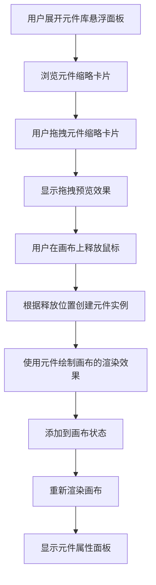
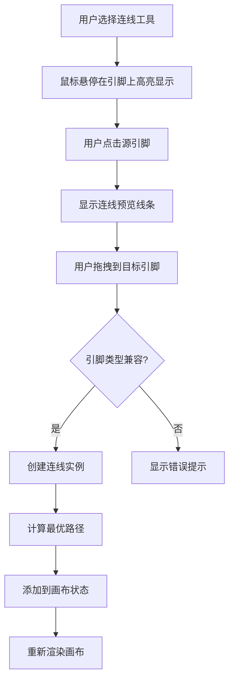
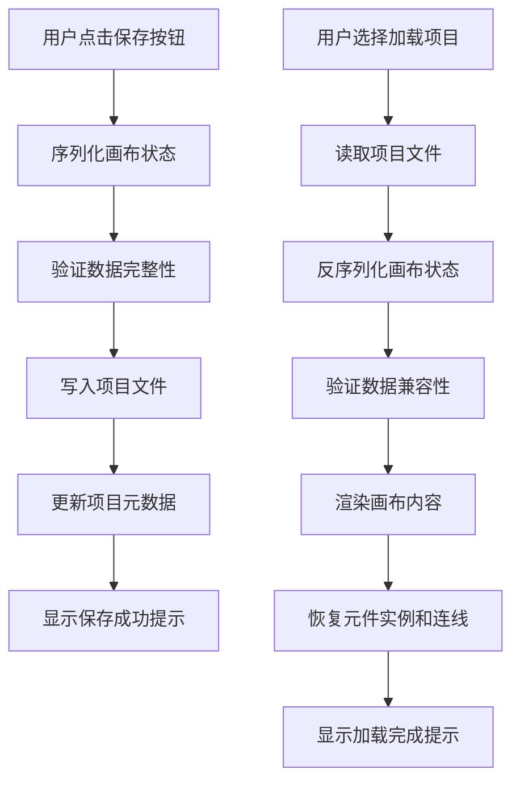

# Fast Hardware - 电路设计画布功能详细需求文档

## 📋 文档概述

### 文档目的
本文档详细描述电路设计画布功能的需求分析、设计方案和实现细节，确保电路设计功能与PRD保持一致，并为开发团队提供完整的开发指南。

### 功能定位
电路设计画布是Fast Hardware的核心功能之一，提供可视化的电路设计环境，支持元件拖拽、连线操作和电路配置，最终生成符合系统标准的JSON格式电路配置文件。

### 📈 当前状态
- ✅ **元件设计器**: 已完成 (1-edit_prd.md)
- ✅ **元件管理系统**: 已完成 (0-Change-Log.md)
- 🚧 **电路设计画布**: 开发中 (本PRD)
- ⏳ **LLM集成**: 规划中 (3-llm_prd.md)

---

## 🎯 功能需求分析

### 核心功能
1. **画布操作**: 提供带有格点的设计画布，支持元件拖拽和放置
2. **元件管理**: 显示元件主体和引脚，支持元件实例化
3. **连线系统**: 实现引脚间的可视化连线，支持路径编辑
4. **数据同步**: 画布操作与JSON数据实时同步
5. **项目管理**: 支持项目保存、加载和版本管理

### 用户场景
- **场景1**: 用户从元件库拖拽元件到画布，自动布局
- **场景2**: 用户手动连接元件引脚，建立电路连接
- **场景3**: 用户调整连线路径，优化电路布局
- **场景4**: 用户保存和加载电路设计项目

### 设计约束
- **画布尺寸**: 自适应画布容器，支持无限扩展
- **元件显示**: 与元件设计器完全一致的矩形主体 + 彩色引脚圆点渲染
- **元件尺寸**: 保持与元件设计器相同的尺寸比例和显示效果
- **连线类型**: 直线和折线路径
- **数据同步**: 非实时保存，按需保存(Ctrl+S)

---

## 🎨 用户界面设计

### 界面组件详述

#### 1. 元件库悬浮面板
**位置**: 左侧悬浮面板，可隐藏为侧边条
**宽度**: 固定25%宽度
**展开/收起**: 点击侧边条可展开/收起面板
**展开状态包含组件**:
- 元件搜索框
- 元件分类筛选
- 元件缩略卡片列表
- 拖拽到画布释放提示

**缩略卡片功能**:
- 显示元件图标和名称
- 支持拖拽操作
- 拖拽到画布释放后自动渲染元件
- 渲染效果完全参考元件绘制画布

#### 2. 设计画布 (主体区域)
**画布类型**: HTML5 Canvas
**画布尺寸**: 自适应容器大小，支持无限扩展和滚动
**背景**: 格点背景(10px网格)
**缩放支持**: 支持鼠标滚轮缩放和拖拽平移
**交互功能**:
- 元件拖拽放置 (从元件库拖拽释放)
- 元件旋转(90度步进)
- 引脚连线
- 连线编辑
- 选择和删除
- 画布缩放和平移

#### 3. 属性面板 (右侧)
**位置**: 右侧固定面板
**功能**: 显示选中元件和连线属性
**内容**: 元件参数、连线属性、画布设置
**交互**: 属性编辑和参数调整
**特殊功能**: 实时属性同步更新

#### 4. 工具栏 (画布上方)
**位置**: 画布顶部
**工具按钮**:
- 保存 (Ctrl+S)
- 撤销/重做
- 缩放控制
- 网格显示切换
- 全选/清空

---

## 📊 数据结构设计

### 画布状态数据结构
```javascript
class CanvasState {
  constructor() {
    this.canvas = {
      width: 'auto', // 自适应容器宽度
      height: 'auto', // 自适应容器高度
      zoom: 1.0,
      panX: 0,
      panY: 0,
      gridSize: 10,
      showGrid: true,
      minZoom: 0.1, // 最小缩放比例
      maxZoom: 5.0  // 最大缩放比例
    };

    this.components = []; // 元件实例数组
    this.connections = []; // 连接关系数组
    this.selectedItems = []; // 选中项
    this.history = []; // 操作历史
  }
}
```

### 元件实例数据结构
```javascript
class ComponentInstance {
  constructor(componentData) {
    this.componentFile = componentData.id + '.json'; // 引用元件文件
    this.instanceId = 'instance_' + Date.now(); // 实例唯一ID
    this.position = { x: 100, y: 100 }; // 画布位置
    this.orientation = 'up'; // 朝向: up, down, left, right
    this.properties = {}; // 自定义属性
    this.selected = false; // 选中状态
  }
}
```

### 连线数据结构
```javascript
class Connection {
  constructor() {
    this.id = 'wire_' + Date.now();
    this.source = {
      instanceId: 'instance_1',
      pinName: 'D13'
    };
    this.target = {
      instanceId: 'instance_2',
      pinName: 'LED_IN'
    };
    this.wireType = 'digital'; // digital, analog, power
    this.routingPoints = []; // 路径节点数组
    this.style = {
      color: '#ff6b6b',
      thickness: 2,
      selected: false
    };
  }
}
```

---

## 🔧 核心功能模块

### 1. 画布渲染引擎

#### 功能职责
- 绘制格点背景和坐标系
- 渲染元件实例和引脚
- 绘制连线和路径
- 处理鼠标交互事件
- 管理缩放和平移变换

#### 关键方法
```javascript
class CanvasRenderer {
  constructor(canvas) {
    this.canvas = canvas;
    this.ctx = canvas.getContext('2d');
    this.state = new CanvasState();
  }

  render() {
    this.clearCanvas();
    this.drawGrid();
    this.drawComponents();
    this.drawConnections();
    this.drawSelection();
  }

  drawComponent(component) {
    const { position, orientation } = component;
    const componentData = this.loadComponentData(component.componentFile);

    // 根据朝向计算变换
    this.ctx.save();
    this.applyTransform(position, orientation);

    // 绘制元件主体
    this.drawComponentBody(componentData);

    // 绘制引脚
    this.drawPins(componentData.pins);

    this.ctx.restore();
  }

  drawConnection(connection) {
    const points = this.calculateConnectionPath(connection);
    this.ctx.strokeStyle = connection.style.color;
    this.ctx.lineWidth = connection.style.thickness;

    this.ctx.beginPath();
    points.forEach((point, index) => {
      if (index === 0) {
        this.ctx.moveTo(point.x, point.y);
      } else {
        this.ctx.lineTo(point.x, point.y);
      }
    });
    this.ctx.stroke();
  }
}
```

### 2. 交互管理器

#### 功能职责
- 处理鼠标事件(点击、拖拽、双击)
- 管理选中状态
- 执行元件操作(移动、旋转、删除)
- 处理连线创建和编辑

#### 鼠标事件处理
```javascript
class InteractionManager {
  constructor(canvas, renderer) {
    this.canvas = canvas;
    this.renderer = renderer;
    this.isDragging = false;
    this.dragStart = null;
    this.selectedTool = 'select'; // select, wire, pan, zoom
  }

  handleMouseDown(e) {
    const mousePos = this.getMousePosition(e);
    const hitItem = this.getHitItem(mousePos);

    if (this.selectedTool === 'wire' && hitItem.type === 'pin') {
      this.startWiring(hitItem);
    } else if (hitItem) {
      this.selectItem(hitItem);
      this.startDrag(mousePos);
    }
  }

  handleMouseMove(e) {
    const mousePos = this.getMousePosition(e);

    if (this.isDragging) {
      this.updateDrag(mousePos);
    } else if (this.isWiring) {
      this.updateWiring(mousePos);
    } else {
      this.updateHover(mousePos);
    }
  }

  handleMouseUp(e) {
    if (this.isDragging) {
      this.endDrag();
    } else if (this.isWiring) {
      this.endWiring();
    }
  }
}
```

### 3. 元件管理器

#### 功能职责
- 管理元件库数据和悬浮面板状态
- 处理元件实例化（支持拖拽释放）
- 管理元件状态和属性
- 与元件库悬浮面板交互

```javascript
class ComponentManager {
  constructor() {
    this.library = {}; // 元件库缓存
    this.instances = []; // 当前画布上的元件实例
  }

  async loadComponentLibrary() {
    // 从系统元件库加载所有元件
    const standardComponents = await this.loadFromDirectory('data/system-components/standard/');
    const customComponents = await this.loadFromDirectory('data/system-components/custom/');

    this.library = { ...standardComponents, ...customComponents };
  }

  createInstance(componentId, position, options = {}) {
    const componentData = this.library[componentId];
    if (!componentData) return null;

    const instance = new ComponentInstance(componentData);
    instance.position = position;

    // 处理拖拽释放的特殊选项
    if (options.fromDrag) {
      // 使用元件绘制画布的渲染效果
      instance.renderStyle = 'designer-compatible';
      // 根据释放位置进行微调
      instance.position = this.adjustPositionForRelease(position);
    }

    this.instances.push(instance);
    return instance;
  }

  removeInstance(instanceId) {
    this.instances = this.instances.filter(inst => inst.instanceId !== instanceId);
  }
}
```

### 4. 连线管理器

#### 功能职责
- 创建和管理连线
- 计算连线路径
- 处理连线编辑

```javascript
class ConnectionManager {
  constructor() {
    this.connections = [];
    this.tempConnection = null; // 正在创建的连线
  }

  startConnection(sourcePin) {
    this.tempConnection = new Connection();
    this.tempConnection.source = sourcePin;
  }

  updateConnection(mousePos) {
    if (!this.tempConnection) return;

    // 计算从源引脚到鼠标位置的路径
    const sourcePos = this.getPinPosition(this.tempConnection.source);
    this.tempConnection.routingPoints = this.calculatePath(sourcePos, mousePos);
  }

  finishConnection(targetPin) {
    if (!this.tempConnection) return;

    this.tempConnection.target = targetPin;
    this.tempConnection.routingPoints = this.optimizePath(this.tempConnection.routingPoints);

    this.connections.push(this.tempConnection);
    this.tempConnection = null;
  }

  calculatePath(from, to) {
    // 简单的直线路径计算
    return [from, to];
  }

  optimizePath(points) {
    // 路径优化算法
    // 移除不必要的拐点
    // 确保路径不与元件重叠
    return points;
  }
}
```

### 5. 项目管理器

#### 功能职责
- 管理项目文件读写操作
- 处理项目数据导入导出
- 维护项目版本历史
- 协调画布状态与文件系统

```javascript
class ProjectManager {
  constructor(canvasState) {
    this.canvasState = canvasState;
    this.currentProject = null;
  }

  async saveProject(filePath) {
    const projectData = this.serializeCanvasState();
    await this.writeProjectFile(filePath, projectData);
    return { success: true };
  }

  async loadProject(filePath) {
    const projectData = await this.readProjectFile(filePath);
    this.deserializeCanvasState(projectData);
    this.canvasState.render();
    return { success: true };
  }

  serializeCanvasState() {
    return {
      components: this.canvasState.components,
      connections: this.canvasState.connections,
      canvas: this.canvasState.canvas
    };
  }
}
```

---

## 🔄 交互流程

### 1. 元件拖拽放置流程


### 2. 连线创建流程


### 3. 项目保存和加载流程


---

## 💾 数据持久化

### 保存策略
1. **非实时保存**: 仅在用户主动触发时保存
2. **原子性保存**: 确保数据一致性
3. **版本管理**: 支持基本的版本历史

### 保存流程
```javascript
class DataManager {
  async saveProject() {
    const projectData = {
      projectName: this.projectName,
      version: this.version,
      description: this.description,
      components: this.canvasState.components.map(comp => ({
        componentFile: comp.componentFile,
        instanceId: comp.instanceId,
        position: comp.position,
        orientation: comp.orientation,
        properties: comp.properties
      })),
      connections: this.canvasState.connections.map(conn => ({
        id: conn.id,
        source: conn.source,
        target: conn.target,
        wireType: conn.wireType,
        routingPoints: conn.routingPoints,
        style: conn.style
      }))
    };

    // 保存到项目目录
    await this.saveToFile('circuit_config.json', projectData);

    // 更新元数据
    await this.updateMetadata();

    return { success: true };
  }
}
```

---

## 🎯 技术实现细节

### 1. 坐标系统和变换
- **世界坐标**: 元件位置和连线路径，与元件设计器坐标系统完全一致
- **屏幕坐标**: 鼠标位置和渲染坐标，支持缩放和平移变换
- **变换矩阵**: 处理缩放、平移、旋转，与元件设计器的变换逻辑保持一致
- **像素密度**: 支持高DPI显示，与元件设计器相同的像素密度处理

### 2. 碰撞检测
- **点与元件**: 鼠标点击元件检测，与元件设计器使用相同的碰撞检测算法
- **点与引脚**: 引脚点击检测，使用圆形区域检测
- **线段相交**: 连线路径冲突检测和优化
- **边界检测**: 自适应边界检测，支持无限画布范围

### 3. 性能优化
- **脏标记更新**: 只重新渲染变化的部分，与元件设计器相同的优化策略
- **状态缓存**: 缓存元件渲染状态，避免重复计算
- **分层渲染**: 分离元件层、连线层、交互层
- **防抖优化**: 鼠标移动和窗口大小改变事件防抖处理

### 4. 响应式设计
- **自适应布局**: 支持不同窗口尺寸，与元件设计器相同的响应式处理
- **触摸支持**: 移动端友好的交互，支持触摸拖拽和缩放
- **键盘快捷键**: 与元件设计器保持一致的快捷键系统
- **无障碍支持**: 键盘导航和屏幕阅读器支持

---

## 🧪 测试用例

### 单元测试
1. **画布渲染测试**
   - 格点背景正确绘制
   - 元件位置和朝向正确渲染
   - 连线路径正确计算和绘制

2. **交互测试**
   - 鼠标事件正确捕获和处理
   - 悬浮面板展开/收起功能正常
   - 元件库卡片拖拽操作正确
   - 元件拖拽到画布释放位置正确
   - 连线创建和删除功能正常

3. **数据同步测试**
   - 画布状态与JSON数据保持一致
   - 保存和加载操作正确执行
   - 版本历史正确记录

### 集成测试
1. **完整工作流测试**
   - 悬浮面板展开和元件浏览流程
   - 从元件库卡片到画布的完整拖拽释放流程
   - 元件渲染效果与元件绘制画布一致性验证
   - 连线创建和编辑的完整流程
   - 保存和加载项目的完整流程

2. **数据持久化测试**
   - 项目文件读写操作正确
   - 数据序列化反序列化准确
   - 项目版本管理正常工作

### 用户验收测试
1. **功能验收**
   - 悬浮面板展开/收起操作流畅
   - 元件库卡片拖拽到画布释放准确
   - 元件渲染效果与元件绘制画布完全一致
   - 连线创建和编辑直观易用
   - 画布缩放和平移操作自然

2. **性能验收**
   - 大量元件时的渲染性能
   - 复杂连线网络的响应速度
   - 内存使用和稳定性表现

---

## 📅 开发计划

### 阶段一：基础画布功能 (2周) ✅ 已完成
- [x] 画布初始化和格点背景
- [x] 悬浮面板设计和交互实现（默认收起状态）
- [x] 悬浮面板元件拖拽和放置功能
- [x] 简单的元件渲染（矩形+引脚）
- [ ] 连线系统基础实现
- [ ] 数据同步机制

### 阶段二：连线和交互完善 (2周)
- [ ] 手动连线功能（直线和折线）
- [ ] 连线编辑和删除
- [ ] 引脚兼容性检查
- [ ] 路径优化算法
- [ ] 撤销/重做功能

### 阶段三：高级功能和测试 (3周)
- [ ] 键盘快捷键系统 (Ctrl+S保存, Ctrl+Z撤销等)
- [ ] 批量操作功能 (多选、批量移动、批量删除)
- [ ] 项目导入导出 (支持标准JSON格式)
- [ ] 性能优化 (大电路渲染优化)
- [ ] 完整测试覆盖 (单元测试、集成测试)
- [ ] 用户体验优化 (界面响应、错误提示)

---

## 🎯 成功指标

### 功能指标
- [ ] 用户能够在5分钟内完成简单电路搭建
- [ ] 支持至少20种常用电子元件
- [ ] 连线创建成功率 > 95%
- [ ] 项目文件兼容性 > 95%

### 性能指标
- [ ] 画布渲染帧率 > 30FPS
- [ ] 支持同时显示50+元件
- [ ] 连线响应延迟 < 100ms
- [ ] 内存使用 < 200MB

### 用户体验指标
- [ ] 界面操作符合行业标准
- [ ] 错误提示清晰准确
- [ ] 学习曲线平缓
- [ ] 用户满意度 > 85%

---

## 🚀 技术风险与应对

### 主要技术挑战
1. **复杂交互处理**: 大量鼠标事件和状态管理
2. **性能瓶颈**: 大型电路的渲染和交互性能
3. **数据一致性**: 画布状态与JSON数据的同步
4. **用户操作复杂性**: 多步骤操作流程和错误恢复

### 风险缓解策略
1. **模块化设计**: 将功能拆分为独立模块
2. **性能监控**: 实时监控和优化性能瓶颈
3. **数据验证**: 多重校验确保数据一致性
4. **用户测试**: 早期进行用户测试，确保操作流程合理

---

## 📚 相关文档

### 依赖文档
- [PRD.md](./PRD.md) - 产品需求文档
- [edit_prd.md](./edit_prd.md) - 元件设计器详细设计文档
- [data/README_data.md](./data/README_data.md) - 数据结构说明
- [data/projects/README_proj.md](./data/projects/README_proj.md) - 项目结构说明

### 设计资源
- [Fast Hardware.txt](./Fast Hardware.txt) - 原始功能描述
- [README.md](./README.md) - 项目说明文档

---

## 🔄 开发进度记录

### 当前状态总结 ✅
**已完成功能**:
- ✅ 基础画布框架搭建
- ✅ 元件库集成
- ✅ 元件拖拽基础功能
- ✅ 简单元件渲染
- ✅ 项目数据结构设计

**开发中功能**:
- 🚧 连线系统实现 (直线和折线路径)
- 🚧 高级交互功能 (多选、撤销重做)
- 🚧 项目管理功能 (保存加载)

**下一阶段目标**: 实现完整的连线系统和交互功能，为用户提供流畅的电路设计体验。LLM集成功能将在后续版本中实现。

---

*本文档将随着开发进度持续更新，确保与实际实现保持同步。*
