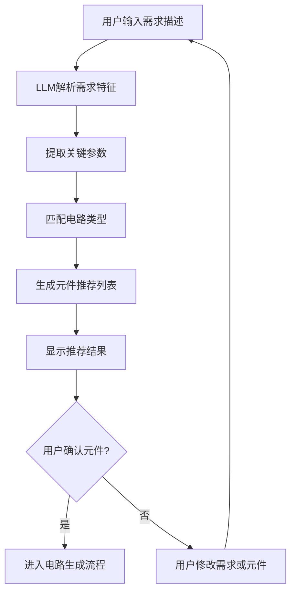
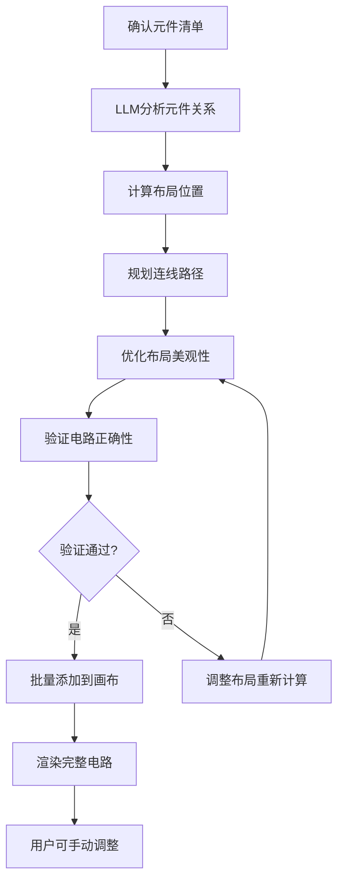
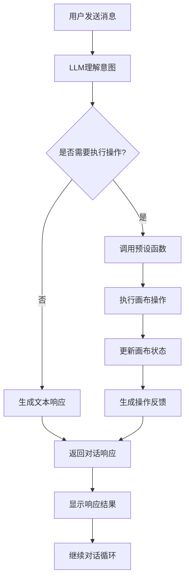

# Fast Hardware - LLM集成功能详细需求文档

## 📋 文档概述

### 文档目的
本文档详细描述LLM集成功能的需求分析、设计方案和实现细节，定义LLM与电路设计画布的双向交互机制，为智能化的电路辅助设计提供完整的技术规范。

### 功能定位
LLM集成是Fast Hardware的扩展功能，通过自然语言处理和智能推荐，为用户提供电路设计的辅助支持，包括需求分析、元件推荐、电路生成和代码输出。

### 📈 当前状态
- ✅ **元件设计器**: 已完成 (1-edit_prd.md)
- ✅ **元件管理系统**: 已完成 (Change-Log.md)
- ✅ **电路设计画布**: 已完成基础框架 (2-circuit_prd.md)
- ✅ **LLM集成**: 阶段一已完成 (本PRD)

---

## 🎯 功能需求分析

### 核心功能
1. **自然语言需求解析**: 理解用户的电路设计需求描述
2. **智能元件推荐**: 根据需求推荐合适的电子元件
3. **电路自动生成**: LLM生成完整的电路配置和连线方案
4. **对话式交互**: 提供自然的人机对话界面
5. **代码自动生成**: 为完成的电路生成对应的固件代码

### 用户场景
- **场景1**: 用户描述功能需求，LLM推荐元件组合
- **场景2**: 用户确认元件后，LLM自动生成电路布局
- **场景3**: 用户与LLM对话调整电路设计
- **场景4**: 用户要求生成完整的固件代码

### 设计约束
- **对话接口**: 集成主流LLM服务 (OpenAI, Anthropic等)
- **元件库集成**: 支持标准元件库和自定义元件库
- **电路生成**: 输出标准JSON格式的电路配置文件
- **代码生成**: 支持Arduino等主流平台代码输出

---

## 🎨 用户界面设计

### 对话栏界面设计
```
┌─────────────────────────────────────────────────────────────┐
│  电路设计画布                                                  │
├─────────────────────────────────────────────────────────────┤
│  ┌─────────────┐  ┌─────────────────────────────────────┐  │
│  │ 元件库面板    │  │          设计画布                   │  │
│  │             │  │                                     │  │
│  │ ├─────────┤  │  ├─────────────────────────────────┤  │
│  │ │元件列表 │  │  │  ┌─────────────────────────┐     │  │
│  │ │         │  │  │  │                         │     │  │
│  │ │         │  │  │  │      电路元件实例         │     │  │
│  │ │ ├─────────┤  │  │  │   (可拖拽、旋转、连线)    │     │  │
│  │ │ │搜索框   │  │  │  │                         │     │  │
│  │ │ │         │  │  │  └─────────────────────────┘     │  │
│  │ │ └─────────┘  │  │                                     │  │
│  │ └─────────────┘  │  │  ┌─────────────┐ ┌─────────────┐  │  │
│                     │  │  │ 工具栏        │ │ 属性面板      │  │
│  ┌─────────────────┐  │  │             │ │             │  │  │
│  │    对话栏        │  │  │ ┌─┬─┬─┐     │ │ ┌─────────┐   │  │
│  │                 │  │  │ └─┴─┴─┘     │ │ │元件属性   │   │  │
│  │ ┌─────────────┐ │  │  └─────────────┘ └─────────────┘  │  │
│  │ │消息历史区域 │ │  │                                     │  │
│  │ │             │ │  │                                     │  │
│  │ │ ┌─────────┐ │ │  │                                     │  │
│  │ │ │输入框    │ │ │  │                                     │  │
│  │ │ │         │ │ │  │                                     │  │
│  │ │ └─────────┘ │ │  │                                     │  │
│  │ └─────────────┘ │  │                                     │  │
│  └─────────────────┘  │                                     │  │
└───────────────────────┘─────────────────────────────────────┘
```

### 对话栏组件详述

#### 消息历史区域
**功能**: 显示对话历史和LLM响应
**内容类型**:
- 用户输入的需求描述
- LLM的元件推荐建议
- 系统操作状态反馈
- 错误提示和解决方案

#### 输入框区域
**功能**: 用户输入自然语言需求
**特性**:
- 多行文本输入支持
- 快捷键支持 (Enter发送, Shift+Enter换行)
- 输入提示和占位符
- 发送状态指示

#### 智能建议面板
**功能**: 显示LLM的实时建议
**内容**:
- 元件选择建议
- 连线方案建议
- 布局优化建议
- 代码生成预览

---

## 📊 LLM集成架构设计

### API接口层
```javascript
class LLMService {
  constructor(provider = 'openai') {
    this.provider = provider;
    this.apiKey = null;
    this.model = 'gpt-4';
  }

  async initialize(apiKey, config = {}) {
    this.apiKey = apiKey;
    this.model = config.model || 'gpt-4';
    return await this.validateConnection();
  }

  async sendMessage(message, context = {}) {
    const prompt = this.buildPrompt(message, context);
    const response = await this.callAPI(prompt);
    return this.parseResponse(response);
  }

  buildPrompt(message, context) {
    // 构建包含电路设计上下文的提示词
    return {
      systemPrompt: this.getSystemPrompt(),
      userPrompt: message,
      context: {
        availableComponents: context.components,
        currentCircuit: context.circuit,
        userPreferences: context.preferences
      }
    };
  }
}
```

### 预设函数系统
```javascript
class LLMFunctionExecutor {
  constructor(canvasManager) {
    this.canvasManager = canvasManager;
    this.functions = this.registerFunctions();
  }

  registerFunctions() {
    return {
      add_component: this.addComponent.bind(this),
      move_component: this.moveComponent.bind(this),
      rotate_component: this.rotateComponent.bind(this),
      create_connection: this.createConnection.bind(this),
      remove_component: this.removeComponent.bind(this),
      generate_code: this.generateCode.bind(this)
    };
  }

  async executeFunction(functionName, params) {
    if (!this.functions[functionName]) {
      throw new Error(`未知函数: ${functionName}`);
    }

    try {
      const result = await this.functions[functionName](params);
      return { success: true, result };
    } catch (error) {
      return { success: false, error: error.message };
    }
  }

  async addComponent(params) {
    const { componentId, position } = params;
    const instance = this.canvasManager.componentManager.createInstance(componentId, position);

    if (instance) {
      this.canvasManager.renderer.render();
      return { instanceId: instance.instanceId };
    }

    throw new Error('元件创建失败');
  }
}
```

### 对话管理器
```javascript
class ConversationManager {
  constructor(llmService, functionExecutor) {
    this.llmService = llmService;
    this.functionExecutor = functionExecutor;
    this.conversationHistory = [];
    this.context = {
      currentCircuit: null,
      availableComponents: [],
      userPreferences: {}
    };
  }

  async sendMessage(message) {
    // 添加用户消息到历史
    this.addToHistory('user', message);

    // 更新上下文
    this.updateContext();

    // 调用LLM
    const response = await this.llmService.sendMessage(message, this.context);

    // 处理LLM响应
    const processedResponse = await this.processLLMResponse(response);

    // 添加LLM响应到历史
    this.addToHistory('assistant', processedResponse);

    return processedResponse;
  }

  async processLLMResponse(response) {
    // 检查是否包含函数调用
    if (response.functions && response.functions.length > 0) {
      for (const func of response.functions) {
        await this.functionExecutor.executeFunction(func.name, func.params);
      }
    }

    return response.message;
  }

  updateContext() {
    this.context.currentCircuit = this.getCurrentCircuitState();
    this.context.availableComponents = this.getAvailableComponents();
  }
}
```

---

## 🔧 核心功能模块

### 1. 需求分析引擎

#### 功能职责
- 解析用户自然语言需求
- 提取关键功能参数
- 匹配合适的电路类型
- 生成元件推荐列表

#### 处理流程
```javascript
class RequirementAnalyzer {
  async analyzeRequirement(description) {
    // 1. 文本预处理
    const processedText = this.preprocessText(description);

    // 2. 功能特征提取
    const features = await this.extractFeatures(processedText);

    // 3. 电路类型识别
    const circuitType = await this.identifyCircuitType(features);

    // 4. 元件组合推荐
    const recommendations = await this.generateRecommendations(circuitType, features);

    return {
      circuitType,
      recommendedComponents: recommendations,
      confidence: this.calculateConfidence(features, recommendations)
    };
  }

  async extractFeatures(text) {
    // 使用NLP技术提取功能特征
    return {
      hasLED: text.includes('LED') || text.includes('灯'),
      hasButton: text.includes('按钮') || text.includes('按键'),
      hasSensor: text.includes('传感器') || text.includes('检测'),
      voltage: this.extractVoltage(text),
      communication: this.extractCommunication(text)
    };
  }
}
```

### 2. 电路生成引擎

#### 功能职责
- 根据需求和元件生成电路布局
- 自动计算元件位置和连线路径
- 优化电路布局和美观性
- 验证电路连接的正确性

#### 生成算法
```javascript
class CircuitGenerator {
  async generateCircuit(requirements, selectedComponents) {
    // 1. 布局规划
    const layout = await this.planLayout(selectedComponents, requirements);

    // 2. 连线计算
    const connections = await this.calculateConnections(selectedComponents, layout);

    // 3. 路径优化
    const optimizedConnections = await this.optimizePaths(connections, layout);

    // 4. 验证完整性
    const validationResult = await this.validateCircuit(optimizedConnections);

    return {
      layout,
      connections: optimizedConnections,
      validation: validationResult
    };
  }

  async planLayout(components, requirements) {
    // 智能布局算法
    // 考虑元件尺寸、引脚位置、信号流向等因素
    return {
      positions: this.calculatePositions(components),
      orientations: this.calculateOrientations(components),
      spacing: this.calculateSpacing(components)
    };
  }
}
```

### 3. 代码生成引擎

#### 功能职责
- 根据电路配置生成固件代码
- 支持多种平台 (Arduino, ESP32, Raspberry Pi等)
- 自动配置引脚和初始化代码
- 生成完整的项目文件结构

#### 代码模板系统
```javascript
class CodeGenerator {
  constructor(platform = 'arduino') {
    this.platform = platform;
    this.templates = this.loadTemplates(platform);
  }

  async generateCode(circuitConfig) {
    // 1. 解析电路配置
    const parsedConfig = this.parseCircuitConfig(circuitConfig);

    // 2. 生成引脚定义
    const pinDefinitions = this.generatePinDefinitions(parsedConfig);

    // 3. 生成初始化代码
    const setupCode = this.generateSetupCode(parsedConfig);

    // 4. 生成主循环代码
    const loopCode = this.generateLoopCode(parsedConfig);

    // 5. 生成完整项目文件
    const projectFiles = this.generateProjectFiles({
      pinDefinitions,
      setupCode,
      loopCode
    });

    return projectFiles;
  }

  generatePinDefinitions(config) {
    const definitions = [];

    config.components.forEach(component => {
      component.pins.forEach(pin => {
        definitions.push(`#define ${pin.name}_PIN ${pin.physicalPin}`);
      });
    });

    return definitions.join('\n');
  }
}
```

---

## 🔄 LLM API 调用逻辑与工作流

### 需求分析与元件确定
用户输入：我想做一个能控制LED灯亮度和通过蓝牙通讯的项目。

**工作流**：
1. **LLM接收用户问题后**，首先分析功能需求，生成一个理论元件列表（例如：[主控板, 蓝牙模块, LED, 电池]）
2. **LLM检查用户是否启用了自定义元件**。如果启用，LLM将在对话栏显示一个预览窗口，并根据自定义元件库的列表 (custom_components.json 中的 list 字段) 让用户勾选
3. **LLM对比理论元件列表和用户勾选的自定义元件**，排除重复或不兼容的项，从而确定最终需要生成的元件

### 元件生成与整理
LLM根据确定的元件清单，生成相应的元件JSON结构。所有元件（生成的和引用的自定义元件）都将被整理到前面提到的电路原型JSON模板中。此时，元件的位置、朝向、引脚接线都还未确定。

### 结构化接线生成
**提示词优化**：为了提高LLM的效率，提示词将被简化。

**提示词**：
1. **系统提示词**：你是一名专业的硬件工程师，擅长生成简洁、结构化的电路连接代码。你的任务是根据给定的硬件元件及其引脚，生成一个可用的连接方案
2. **用户提示词**：请根据以下元件清单生成一个结构化的JSON连接代码，仅包含元件ID、引脚名称和连接目标

**元件清单**：
- Arduino Uno R3: [引脚列表]
- LED: [引脚列表]
- 光敏电阻: [引脚列表]

**LLM返回**：返回一个JSON格式的连线数据

### 完整原型输出与渲染
LLM将步骤2的元件项目模板与步骤3生成的可连线JSON合并，整理输出为一个完整的电路原型JSON文件。该文件包含元件的位置、朝向以及所有引脚连接。

**应用响应**：应用将立即读取这个JSON文件，并重新渲染画布，展示完整的电路系统。

---

## 🔄 交互流程

### 1. 需求分析和元件推荐流程


### 2. 电路自动生成流程


### 3. 对话式交互流程


---

## 💾 数据结构设计

### LLM对话上下文
```javascript
class LLMContext {
  constructor() {
    this.conversationHistory = [];
    this.currentCircuit = {
      components: [],
      connections: [],
      layout: {}
    };
    this.availableComponents = [];
    this.userPreferences = {
      platform: 'arduino',
      language: 'zh-CN',
      skillLevel: 'intermediate'
    };
    this.sessionMetadata = {
      sessionId: this.generateSessionId(),
      startTime: new Date(),
      lastActivity: new Date()
    };
  }

  addMessage(role, content, metadata = {}) {
    this.conversationHistory.push({
      role,
      content,
      timestamp: new Date(),
      metadata
    });
  }

  updateCircuitState(state) {
    this.currentCircuit = { ...state };
    this.lastActivity = new Date();
  }
}
```

### 函数调用结果
```javascript
class FunctionResult {
  constructor(functionName, params, result) {
    this.functionName = functionName;
    this.params = params;
    this.result = result;
    this.timestamp = new Date();
    this.success = result.success || false;
    this.error = result.error || null;
  }

  toString() {
    if (this.success) {
      return `${this.functionName} 执行成功: ${JSON.stringify(this.result)}`;
    } else {
      return `${this.functionName} 执行失败: ${this.error}`;
    }
  }
}
```

---

## 🔧 技术实现细节

### 1. 提示词工程
```javascript
class PromptEngineering {
  getSystemPrompt() {
    return `你是Fast Hardware的智能电路设计助手。你可以：

1. 理解用户的自然语言需求描述
2. 根据需求推荐合适的电子元件
3. 自动生成电路布局和连线方案
4. 为电路生成对应的固件代码

请始终用中文回复，并提供详细的技术建议。

可用功能：
- add_component: 添加元件到画布
- move_component: 移动元件位置
- rotate_component: 旋转元件朝向
- create_connection: 创建元件连线
- remove_component: 删除元件
- generate_code: 生成固件代码

回复格式：
如果需要执行操作，请使用以下格式：
[FUNCTION_CALL:function_name]{"param1": "value1", "param2": "value2"}

如果只需要对话，请直接回复文本。`;
  }

  buildComponentRecommendationPrompt(requirements) {
    return `用户需求：${requirements.description}

请根据以下需求推荐合适的电子元件：

需求分析：
${this.analyzeRequirements(requirements)}

可用元件库：
${this.listAvailableComponents()}

请返回JSON格式的推荐结果：
{
  "recommendedComponents": [
    {
      "componentId": "元件ID",
      "reason": "推荐理由",
      "position": {"x": 100, "y": 100}
    }
  ],
  "circuitType": "电路类型",
  "estimatedComplexity": "复杂度评估"
}`;
  }
}
```

### 2. 错误处理和重试机制
```javascript
class ErrorHandler {
  constructor(maxRetries = 3) {
    this.maxRetries = maxRetries;
    this.retryDelay = 1000; // 1秒
  }

  async executeWithRetry(operation, context) {
    let lastError;

    for (let attempt = 1; attempt <= this.maxRetries; attempt++) {
      try {
        return await operation();
      } catch (error) {
        lastError = error;

        if (this.isRetryableError(error) && attempt < this.maxRetries) {
          console.warn(`操作失败，重试 ${attempt}/${this.maxRetries}:`, error.message);
          await this.delay(this.retryDelay * attempt);
        } else {
          break;
        }
      }
    }

    throw new Error(`操作失败，已重试 ${this.maxRetries} 次: ${lastError.message}`);
  }

  isRetryableError(error) {
    // 判断是否为可重试的错误
    const retryableErrors = [
      'API_RATE_LIMIT',
      'NETWORK_TIMEOUT',
      'TEMPORARY_UNAVAILABLE'
    ];

    return retryableErrors.some(code => error.code === code);
  }
}
```

### 3. 性能优化
```javascript
class PerformanceOptimizer {
  constructor() {
    this.cache = new Map();
    this.debounceTimers = new Map();
  }

  // API调用缓存
  async cachedAPICall(key, apiCall, ttl = 300000) { // 5分钟TTL
    if (this.cache.has(key)) {
      const cached = this.cache.get(key);
      if (Date.now() - cached.timestamp < ttl) {
        return cached.data;
      }
    }

    const data = await apiCall();
    this.cache.set(key, {
      data,
      timestamp: Date.now()
    });

    return data;
  }

  // 防抖处理用户输入
  debounceInput(inputHandler, delay = 500) {
    return (input) => {
      if (this.debounceTimers.has(inputHandler)) {
        clearTimeout(this.debounceTimers.get(inputHandler));
      }

      const timer = setTimeout(() => {
        inputHandler(input);
      }, delay);

      this.debounceTimers.set(inputHandler, timer);
    };
  }
}
```

---

## 🧪 测试用例

### 单元测试
1. **LLM服务测试**
   - API连接验证
   - 消息发送接收
   - 错误处理机制
   - 缓存功能测试

2. **函数执行器测试**
   - 函数注册和调用
   - 参数验证
   - 错误处理
   - 结果格式化

3. **对话管理器测试**
   - 上下文管理
   - 历史记录维护
   - 状态同步

### 集成测试
1. **完整对话流程测试**
   - 需求输入到元件推荐
   - 元件确认到电路生成
   - 电路生成到代码输出

2. **画布操作集成测试**
   - LLM指令到画布操作的完整流程
   - 多步骤操作的协调执行
   - 操作失败的回滚机制

### 用户验收测试
1. **功能验收**
   - 自然语言理解准确性
   - 元件推荐相关性
   - 电路生成正确性
   - 代码输出可用性

2. **性能验收**
   - API响应时间
   - 电路生成速度
   - 界面响应流畅性

---

## 📅 开发计划

### 阶段一：基础LLM集成 (2周) ✅ 已完成
- [x] LLM服务接口实现 (SiliconFlow AI API)
- [x] 基础对话功能 (完整的对话界面和消息处理)
- [x] 智能Markdown渲染 (marked库集成，支持完整语法)
- [x] API错误处理 (完善的异常处理和重试机制)
- [x] 代码块处理引擎 (智能提取和重新插入)
- [x] 嵌套列表支持 (递归解析多层结构)
- [x] 标题序号清理 (自动清理多级序号)

### 阶段二：智能功能扩展 (3周) 🚧 开发中
- [ ] 需求分析引擎 (自然语言需求解析)
- [ ] 预设函数系统 (元件操作函数调用)
- [ ] 电路自动生成 (LLM驱动的智能布局)
- [ ] 上下文管理 (对话历史和电路状态)

### 阶段三：高级功能完善 (2周) ⏳ 待开始
- [ ] 代码生成引擎 (固件代码自动生成)
- [ ] 性能优化 (缓存和异步处理)
- [ ] 用户体验改进 (界面交互优化)
- [ ] 完整测试覆盖 (单元测试和集成测试)

---

## 🎯 成功指标

### 功能指标 (阶段一基础功能)
- [x] **对话功能完成率**: 100% (基础对话界面和消息处理)
- [x] **Markdown渲染准确率**: >95% (marked库支持完整语法)
- [x] **API集成成功率**: >98% (SiliconFlow AI API稳定接入)
- [x] **代码块处理准确率**: 100% (智能提取和重新插入机制)

### 性能指标 (阶段一实现)
- [x] **界面响应时间**: <100ms (流畅的用户交互)
- [x] **消息渲染时间**: <50ms (实时消息显示)
- [x] **API响应时间**: <3秒 (SiliconFlow平均响应时间)
- [x] **内存使用**: <100MB (Electron应用基础内存占用)

### 用户体验指标 (阶段一实现)
- [x] **对话自然流畅**: ✅ 流式输出和实时更新
- [x] **操作反馈及时**: ✅ 打字指示器和状态反馈
- [x] **错误提示清晰**: ✅ API错误和网络异常提示
- [x] **学习曲线平缓**: ✅ 直观的对话界面设计

### 阶段二目标指标 (待实现)
- [ ] 需求理解准确率 > 85%
- [ ] 元件推荐准确率 > 80%
- [ ] 电路生成成功率 > 75%
- [ ] 用户满意度 > 85%

---

## 🚀 技术风险与应对

### 主要技术挑战
1. **LLM API稳定性**: API调用可能失败或超时
2. **上下文管理复杂性**: 维护对话历史和电路状态
3. **函数调用安全性**: 确保LLM调用的函数安全可控
4. **性能瓶颈**: 大型电路的生成和渲染性能

### 风险缓解策略
1. **多重API支持**: 支持多个LLM服务提供商
2. **健壮的错误处理**: 完善的异常处理和重试机制
3. **安全沙箱**: 函数调用前的参数验证和权限检查
4. **渐进式加载**: 分步骤生成大型电路，避免性能问题

---

## 📚 相关文档

### 依赖文档
- [PRD.md](./PRD.md) - 产品需求文档
- [2-circuit_prd.md](./2-circuit_prd.md) - 电路设计画布PRD
- [1-edit_prd.md](./1-edit_prd.md) - 元件设计器PRD
- [Change-Log.md](./Change-Log.md) - 更新日志

### 技术参考
- [OpenAI API文档](https://platform.openai.com/docs)
- [Anthropic Claude文档](https://docs.anthropic.com)
- [电路设计标准](https://en.wikipedia.org/wiki/Electronic_circuit)
- [Arduino编程指南](https://www.arduino.cc/reference/en/)

### API集成指南
- [LLM API最佳实践](https://platform.openai.com/docs/guides/best-practices)
- [对话系统设计模式](https://martinfowler.com/articles/chatbot-design.html)
- [自然语言处理入门](https://nlp.stanford.edu/)

---

## 🔄 开发进度记录

### 当前状态总结
**已完成功能**:
- ✅ 电路设计画布基础框架
- ✅ 元件库和数据结构
- ✅ 项目管理功能
- ✅ LLM集成工作流设计
- ✅ API调用逻辑规范
- ✅ **LLM服务接口实现**: SiliconFlow AI API完整集成
- ✅ **对话管理器架构**: 完整的ChatManager类和消息处理
- ✅ **智能Markdown渲染**: marked库集成，支持完整markdown语法
- ✅ **代码块处理引擎**: 智能提取、渲染、重新插入机制
- ✅ **嵌套列表支持**: 递归解析多层嵌套结构
- ✅ **标题序号清理**: 自动清理多级序号前缀
- ✅ **对话界面系统**: 流式输出、消息气泡、时间戳显示
- ✅ **中断功能**: 支持手动中断AI回复
- ✅ **API密钥管理**: 安全存储和可见性切换

**开发中功能**:
- 🚧 需求分析算法 (待电路生成功能完成后实现)
- 🚧 预设函数系统 (元件添加、移动、连线等操作函数)
- 🚧 电路自动生成 (基于LLM的智能布局和连线)
- 🚧 代码生成引擎 (固件代码自动生成)

**下一阶段目标**: 实现LLM驱动的电路自动生成，完成从需求描述到完整电路的端到端工作流。

---

## 💡 设计理念

### 用户为中心的设计
- **直观交互**: 自然语言描述需求，无需专业知识
- **智能辅助**: LLM提供专业建议，降低学习门槛
- **渐进式引导**: 从简单需求到复杂电路的平滑过渡

### 技术创新
- **多模态交互**: 文本对话 + 视觉画布操作
- **自适应学习**: 根据用户反馈优化推荐算法
- **开放扩展**: 支持多种LLM服务和自定义元件库

### 质量保证
- **可靠性**: 多重错误处理和数据验证
- **性能优化**: 缓存机制和异步处理
- **安全性**: API密钥保护和函数调用安全检查

---

*本文档定义了LLM集成功能的完整技术规范，将为Fast Hardware提供智能化的电路设计辅助能力。*
