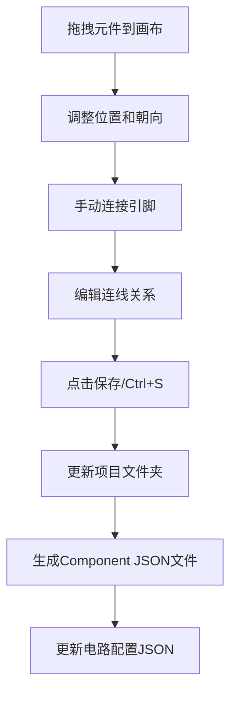
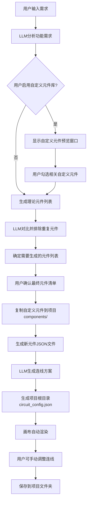
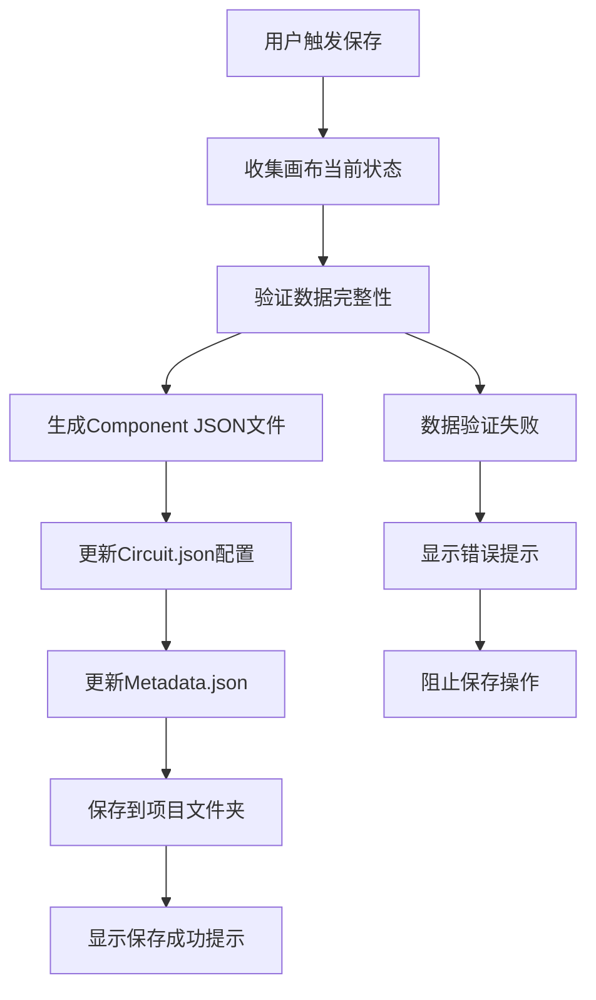
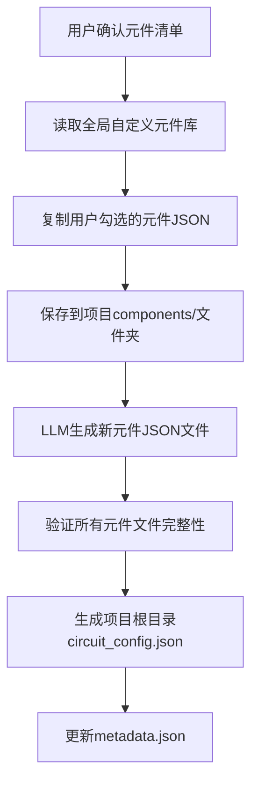
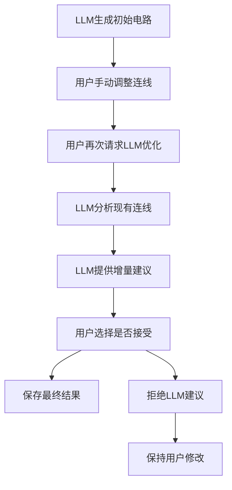

# Fast Hardware 产品需求文档 (PRD)

## 📋 项目概述

### 项目名称
Fast Hardware

### 项目愿景
开发一个桌面端应用，旨在帮助硬件项目新手解决选型、电路搭建和固件编写等问题。通过集成LLM API，为用户提供智能化的硬件开发辅助工具。

### 目标用户
- 硬件开发新手
- 电子工程学生
- 创客和DIY爱好者
- 需要快速原型开发的工程师

## 🎯 核心功能 (按优先级排序)

### 1. 可视化电路设计界面 (高优先级)
- **功能描述**: 70%画布区 + 30%对话栏的主界面布局
- **核心价值**: 提供直观的拖拽式电路设计体验
- **用户场景**: 用户通过拖拽元件和连线快速搭建电路原型
- **关键特性**: 
  - 实时画布操作和JSON数据同步
  - 手动连线和自动布线结合
  - Ctrl+S保存机制

### 2. 智能对话辅助系统 (高优先级)
- **功能描述**: LLM驱动的对话栏，支持自然语言交互
- **核心价值**: 降低硬件选型和电路设计门槛
- **用户场景**: 用户通过对话描述需求，LLM自动生成电路方案
- **关键特性**:
  - 功能需求反推硬件选型
  - 预设函数直接操作画布JSON
  - 电路系统搭建示意生成

### 3. 自定义元件绘制系统 (中等优先级) - **已完成核心框架**
- **功能描述**: 独立的元件设计画布，支持自定义元件创建
- **核心价值**: 提供灵活的元件库扩展能力
- **用户场景**: 用户需要使用标准库中没有的特殊元件时
- **关键特性**:
  - 直观的元件设计界面（属性面板 + 设计画布）
  - 边框点击交互（四条边均可点击添加引脚）
  - 实时视觉反馈（选中边框红色高亮显示）
  - 完整的JSON格式数据导出
  - 保存到系统级元件库便于复用

**已实现功能**:
- ✅ 元件属性面板（名称、类别、描述输入）
- ✅ 简单画布渲染（居中矩形元件显示）
- ✅ 边框点击检测（精确的边框识别）
- ✅ 选中状态视觉反馈（红色高亮边框）
- ✅ 数据结构设计（完整的元件JSON格式）

### 4. 固件代码生成 (中等优先级)
- **功能描述**: 基于电路配置自动生成Arduino代码
- **核心价值**: 自动生成可运行的代码，减少编程工作量
- **用户场景**: 用户完成电路搭建后，需要相应的控制代码时

## 🛠️ 技术架构

### 技术栈选择
- **前端框架**: 纯Electron (桌面端应用，移除React依赖)
- **UI实现**: 原生HTML5 + CSS3 + JavaScript ES6
- **画布渲染**: HTML5 Canvas API (自定义实现)
- **后端服务**: Node.js (用于与 LLM API 交互)
- **LLM API**: Siliconflow API (计划集成)
- **数据存储**: JSON 文件 (用于存储元件库和电路系统)

### 系统架构图
```
┌─────────────────────────────────────────────────────────┐
│                    Electron App                        │
├─────────────────────────────────────────────────────────┤
│  React UI Layer                                        │
│  ┌─────────────┐  ┌─────────────┐  ┌─────────────┐    │
│  │   画布区    │  │   对话栏    │  │  元件库管理  │    │
│  │  (Canvas)   │  │ (Chatbox)   │  │ (Component)  │    │
│  └─────────────┘  └─────────────┘  └─────────────┘    │
├─────────────────────────────────────────────────────────┤
│  Business Logic Layer                                  │
│  ┌─────────────┐  ┌─────────────┐  ┌─────────────┐    │
│  │  JSON管理   │  │  LLM交互    │  │  画布渲染    │    │
│  └─────────────┘  └─────────────┘  └─────────────┘    │
├─────────────────────────────────────────────────────────┤
│  Data Layer                                             │
│  ┌─────────────┐  ┌─────────────┐                      │
│  │自定义元件库  │  │  电路原型   │                      │
│  │    JSON     │  │    JSON     │                      │
│  └─────────────┘  └─────────────┘                      │
└─────────────────────────────────────────────────────────┘
```

## 🎨 用户界面设计

### 画布交互功能详述

#### 手动连线功能
画布需要支持类似Figma的连线操作，具体包括：

1. **连线创建**:
   - 点击源引脚，拖拽到目标引脚
   - 支持连线预览和实时路径计算
   - 自动检测兼容的引脚类型

2. **连线编辑**:
   - 选中连线后可编辑路径节点
   - 支持添加、删除中间路径点
   - 支持连线样式修改（颜色、粗细）

3. **连线删除**:
   - 选中连线后按Delete键删除
   - 支持批量选择和删除

4. **智能路径**:
   - 自动避开其他元件和连线
   - 支持直角和曲线路径模式
   - 动态路径优化

### 主界面布局

#### 1. 主界面 (Main UI) - **高优先级**

##### 1-1 左侧画布区 (Canvas) - 宽度约70%
- **基础功能**: 带有格点的画布，用于元件的拖拽、放置和连接
- **元件渲染**: 支持元件（矩形主体 + 矩形引脚）的绘制和显示
- **交互操作**: 
  - 元件拖拽、旋转、缩放
  - 引脚之间的手动连线操作
  - 连线的编辑、删除和重新路由
- **关键功能**: 当画布上的元件被拖动、旋转或修改连线后，用户点击保存（或Ctrl+S）即可自动更新底层JSON数据

##### 1-2 右侧对话栏 (Chatbox) - 宽度30%
- **基础功能**: 用户与LLM对话的界面
- **输入支持**: 支持文本输入，用于描述功能需求或请求代码
- **关键功能**: LLM可以通过预设函数（如：add_component, move_component, rotate_component, edit_wiring）直接修改JSON，并驱动画布重新渲染

#### 2. 元件库管理 (Component Library) - **中等优先级**

##### 2-1 默认二级标签页 - 元件预览
- **展示方式**: 以缩略图形式展示所有可用元件
- **内容范围**: 包括用户自定义元件和标准元件
- **分类显示**: 按元件类别组织显示

##### 2-2 二级标签页 - 元件绘制
- **独立画布**: 专用于用户自定义元件的形状和引脚排布
- **设计功能**: 用户可以定义引脚的数量、位置、名称和类型（如VCC, GND, I/O）
- **保存机制**: 完成设计后保存到系统级自定义元件库

### 核心交互流程

#### 1. 画布操作流程


#### 2. LLM交互流程


## 📊 数据结构设计

### 数据文件夹整体结构

```
data/
├── system-components/             # 系统级自定义元件库
│   ├── sample_components.json    # 标准元件库
│   ├── custom_example.json       # 自定义元件示例  
│   ├── 用户元件1.json            # 用户创建的自定义元件
│   └── README.md                 # 元件库说明
└── projects/                     # 用户项目文件夹
    ├── 项目1/
    ├── 项目2/
    └── README.md                 # 项目结构说明
```

### 单个项目文件夹结构
每个项目以独立文件夹形式组织：

```
项目名称/
├── components/                    # 项目级元件库（独立副本）
│   ├── arduino-uno-r3.json      # 从系统级复制的元件
│   ├── led-5mm.json              # 或LLM生成的元件
│   └── ...                       # 所有项目使用的元件
├── circuit_config.json           # 电路系统配置文件
├── metadata.json                 # 项目元数据和介绍
├── 代码文件.ino                  # 生成的固件代码
└── README.md                     # 项目说明（可选）
```

### 单个元件文件结构 (components/*.json) **✅ 已实现**
```json
{
  "name": "自定义传感器",
  "id": "custom-sensor-001",
  "description": "用户自定义的温度湿度传感器",
  "category": "sensor",
  "dimensions": {
    "width": 100,
    "height": 80
  },
  "pins": {
    "side1": [
      {
        "pinName": "VCC",
        "type": "power",
        "order": 1
      },
      {
        "pinName": "GND",
        "type": "ground",
        "order": 2
      }
    ],
    "side2": [
      {
        "pinName": "DATA",
        "type": "digital_io",
        "order": 1
      }
    ],
    "side3": [],
    "side4": []
  },
  "specifications": {},
  "designMetadata": {
    "createdAt": "2024-01-01T00:00:00Z",
    "lastModified": "2024-01-01T00:00:00Z",
    "canvasState": {
      "zoom": 1.0,
      "panX": 0,
      "panY": 0
    }
  }
}
```

**引脚类型定义**:
- `power`: 电源引脚
- `ground`: 接地引脚
- `digital_io`: 数字输入输出
- `analog_io`: 模拟输入输出
- `communication`: 通信引脚

**元件类别**:
- `microcontroller`: 微控制器
- `sensor`: 传感器
- `actuator`: 执行器
- `power`: 电源模块
- `communication`: 通信模块
- `auxiliary`: 辅助元件
- `other`: 其他

### 电路系统配置文件 (circuit_config.json)
```json
{
  "projectName": "LED亮度控制项目",
  "version": "1.0.0",
  "description": "使用PWM控制LED亮度的示例项目",
  "components": [
    {
      "componentFile": "arduino-uno-r3.json",  // 引用component文件
      "instanceId": "arduino-1",
      "position": [200, 150],
      "orientation": "up",
      "properties": {
        "customLabel": "主控板"
      }
    },
    {
      "componentFile": "led-5mm.json",
      "instanceId": "led-1", 
      "position": [350, 100],
      "orientation": "up",
      "properties": {
        "color": "red"
      }
    }
  ],
  "connections": [
    {
      "id": "wire-1",
      "source": {
        "instanceId": "arduino-1",
        "pinName": "D9"
      },
      "target": {
        "instanceId": "led-1", 
        "pinName": "正极"
      },
      "wireType": "digital",
      "routingPoints": [
        [220, 170],
        [300, 170],
        [300, 120],
        [330, 120]
      ],
      "style": {
        "color": "#ff6b6b",
        "thickness": 2
      }
    }
  ]
}
```

### 项目元数据文件 (metadata.json)
```json
{
  "createdAt": "2024-01-01T00:00:00Z",
  "lastModified": "2024-01-01T00:00:00Z",
  "author": "用户名",
  "tags": ["LED", "PWM", "基础项目"],
  "version": "1.0.0",
  "description": "项目详细描述",
  "thumbnail": "thumbnail.png",
  "generatedCode": {
    "language": "arduino",
    "file": "generated_code.ino",
    "generatedAt": "2024-01-01T00:00:00Z"
  }
}
```

## 💾 保存机制设计

### 非实时保存策略
画布操作采用非实时保存机制，只有在用户主动触发保存时才更新文件：

#### 保存触发条件
1. **手动保存**: 用户点击保存按钮
2. **快捷键保存**: 用户按下 Ctrl+S (Windows) 或 Cmd+S (macOS)
3. **项目切换保存**: 切换到其他项目前提示保存
4. **应用关闭保存**: 应用关闭前提示保存未保存的更改

#### 保存流程


#### 数据同步策略
- **画布状态**: 维护内存中的完整画布状态
- **变更追踪**: 记录自上次保存以来的所有变更
- **冲突检测**: 检测文件是否被外部程序修改
- **版本管理**: 支持基本的版本历史记录

## 🤖 LLM集成方案

### API调用流程

#### 1. 需求分析与元件确定
**用户输入示例**: "我想做一个能控制LED灯亮度和通过蓝牙通讯的项目"

**LLM处理流程**:
1. **分析功能需求**: LLM解析用户的功能描述
2. **检查自定义元件库启用状态**: 
   - 如果用户启用了自定义元件库，显示自定义元件预览窗口
   - 用户可以勾选相关的自定义元件
   - 用户确认勾选的自定义元件列表
3. **生成理论元件列表**: 基于功能需求生成 [主控板, 蓝牙模块, LED, 电阻, 电池]
4. **元件匹配与排除**: 
   - LLM对比理论元件列表与用户勾选的自定义元件
   - 排除重复或不兼容的元件
   - 确定需要生成的新元件列表
5. **用户确认最终元件清单**: 
   - 展示完整清单（包括引用的自定义元件 + 需要生成的新元件）
   - 用户确认后继续下一步
6. **生成项目Component文件夹**: 
   - 将用户勾选的自定义元件JSON文件复制到项目的components/文件夹
   - 为需要生成的新元件创建独立的JSON文件
   - 所有元件统一存放在项目的components/目录下

#### 2. 电路连接生成
**系统提示词**:
```
你是一名专业的硬件工程师，擅长生成简洁、结构化的电路连接代码。
你的任务是根据给定的硬件元件及其引脚，生成一个可用的连接方案。
生成的连接方案需要支持用户后续的手动调整和编辑。
```

**用户提示词模板**:
```
请根据以下项目components/文件夹中的元件生成一个结构化的circuit_config.json配置文件，
并将其保存在项目根目录下。

项目components/文件夹内容：
- arduino-uno-r3.json: [引脚列表]
- led-5mm.json: [引脚列表]  
- hc05-bluetooth.json: [引脚列表]

生成要求：
1. circuit_config.json文件位置：项目根目录（与components/文件夹同级）
2. 通过componentFile字段引用components/文件夹中的元件文件
3. 生成合理的元件位置和朝向
4. 创建正确的引脚连接关系（包含routingPoints路径节点）
5. 实现LED亮度控制和蓝牙通信功能
6. 包含连线样式信息（颜色、粗细等）
```

#### 3. 固件代码生成
**功能要求**:
- 根据项目根目录下circuit_config.json中的连接关系生成Arduino代码
- 读取components/文件夹中的元件规格信息
- 包含必要的库文件导入
- 实现基本的功能逻辑
- 添加详细的中文注释
- 将生成的代码保存为项目根目录下的.ino文件
- 同时更新metadata.json文件记录代码生成信息

### 自定义元件库集成详述

#### 自定义元件预览窗口
当用户启用自定义元件库后，系统会显示一个预览窗口：

**窗口内容**:
- 显示所有可用的自定义元件（从全局元件库读取）
- 每个元件显示缩略图、名称、类别和简要描述
- 提供搜索和分类筛选功能
- 支持多选勾选操作

**用户操作流程**:
1. 浏览自定义元件库
2. 根据项目需求勾选相关元件
3. 预览已选元件列表
4. 确认勾选并关闭窗口

#### 元件匹配逻辑
LLM执行智能匹配和排除：

**匹配规则**:
- 按功能类别匹配（如：用户勾选了自定义蓝牙模块，则排除标准蓝牙模块）
- 按引脚兼容性匹配（确保连接可行性）
- 按电压等级匹配（避免不兼容的电压组合）

**排除策略**:
- 移除功能重复的标准元件
- 保留无替代的必需元件
- 提示用户关于替换的元件信息

#### 文件操作流程


### LLM与手动操作协调机制

#### 数据格式统一
- **LLM生成的数据结构与手动编辑完全兼容**
- 所有操作（LLM自动生成/用户手动编辑）都使用相同的JSON格式
- 确保数据的双向兼容性

#### 操作优先级
1. **用户手动操作优先**: 用户的手动编辑始终被保留
2. **LLM增量更新**: LLM只添加新内容，不覆盖用户的手动修改
3. **冲突提示**: 当LLM建议与用户操作冲突时，提供选择对话框

#### 协作流程


#### 版本控制支持
- **操作历史记录**: 记录每次LLM生成和用户手动操作
- **分支管理**: 支持在LLM建议和用户版本间切换
- **合并策略**: 提供智能合并工具

## 📅 开发计划

### 阶段一：MVP (Minimum Viable Product) - 4周

#### 高优先级任务 (主界面核心功能)
- [×] **搭建纯Electron开发环境**: 移除React依赖，使用原生HTML5+CSS3+JS
- [×] **实现主界面布局**: 70%画布区 + 30%对话栏
- [×] **实现基础画布功能**: 格点背景、缩放、平移、工具栏
- [ ] **实现手动连线功能**: 引脚连接、路径编辑、连线删除
- [ ] **实现保存机制**: Ctrl+S触发项目文件夹更新
- [ ] **集成LLM对话栏**: 基础文本交互和智能响应

#### 中等优先级任务 (元件库管理)
- [ ] **实现元件预览标签页**: 缩略图展示系统级元件库
- [ ] **实现元件绘制标签页**: 自定义元件设计画布
- [ ] **完善LLM API集成**: 需求分析流程和自定义元件库集成

### 阶段二：功能扩展 - 3周
- [ ] 完善 LLM 元件匹配和排除逻辑
- [ ] 实现 LLM 自动连线功能（与手动连线兼容）
- [ ] 实现 LLM 与手动操作的协调机制（增量更新、冲突处理）
- [ ] 固件代码生成功能（基于circuit.json和components/文件夹）
- [ ] 项目导出和导入功能（完整文件夹打包）

### 阶段三：优化与增强 - 2周
- [ ] 优化 UI/UX，提升用户体验
- [ ] 增加更多预设的常用硬件元件
- [ ] 实现高级LLM交互功能
- [ ] 错误排查和代码优化建议

## 🎯 成功指标

### 功能指标
- [ ] 用户能够成功创建自定义元件
- [ ] LLM能够根据需求推荐合适的硬件清单
- [ ] 系统能够生成正确的电路连接方案
- [ ] 生成的固件代码能够成功编译和运行

### 性能指标
- [ ] 应用启动时间 < 3秒
- [ ] LLM API响应时间 < 10秒
- [ ] 画布操作响应时间 < 100ms
- [ ] 支持100+元件的电路设计

### 用户体验指标
- [ ] 新用户能够在30分钟内完成第一个项目
- [ ] 界面操作直观易懂
- [ ] 错误提示清晰准确
- [ ] 支持项目的保存和加载

## 🚀 技术风险与挑战

### 主要技术挑战
1. **画布渲染性能**: 大量元件和连线时的渲染优化
2. **手动连线交互**: 实现类似Figma的流畅连线体验
3. **项目文件夹管理**: 多文件结构的一致性和完整性维护
4. **LLM与手动操作协调**: LLM自动生成与用户手动编辑的无缝集成
5. **非实时保存**: 内存状态管理和数据丢失防护
6. **连线路径算法**: 智能路径规划和冲突避免

### 风险缓解策略
1. **性能优化**: 
   - 使用Canvas虚拟化渲染
   - 连线路径缓存和增量更新
   - 大型项目的懒加载策略

2. **交互体验优化**:
   - 实现连线的实时预览和吸附效果
   - 支持撤销/重做操作栈
   - 提供丰富的视觉反馈

3. **数据一致性**:
   - 文件锁定机制防止并发写入
   - 原子性保存操作
   - 自动备份和恢复机制

4. **集成兼容性**:
   - LLM生成的数据格式与手动编辑完全兼容
   - 提供数据验证和修复工具
   - 支持增量式LLM更新

## 📝 后续迭代计划

### 版本 2.0 规划
- [ ] 电路仿真功能
- [ ] 协作功能
- [ ] 云端同步

### 版本 3.0 规划
- [ ] 移动端支持
- [ ] 社区元件库
- [ ] AI助手语音交互
- [ ] 实时硬件调试

