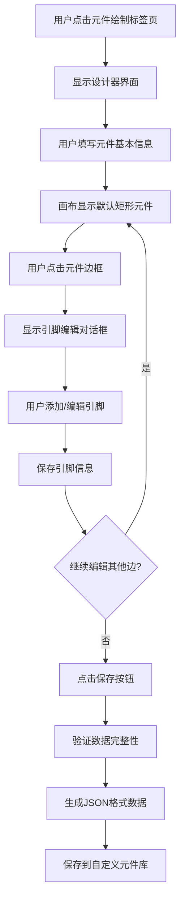
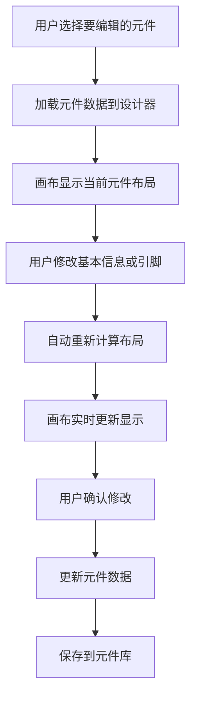
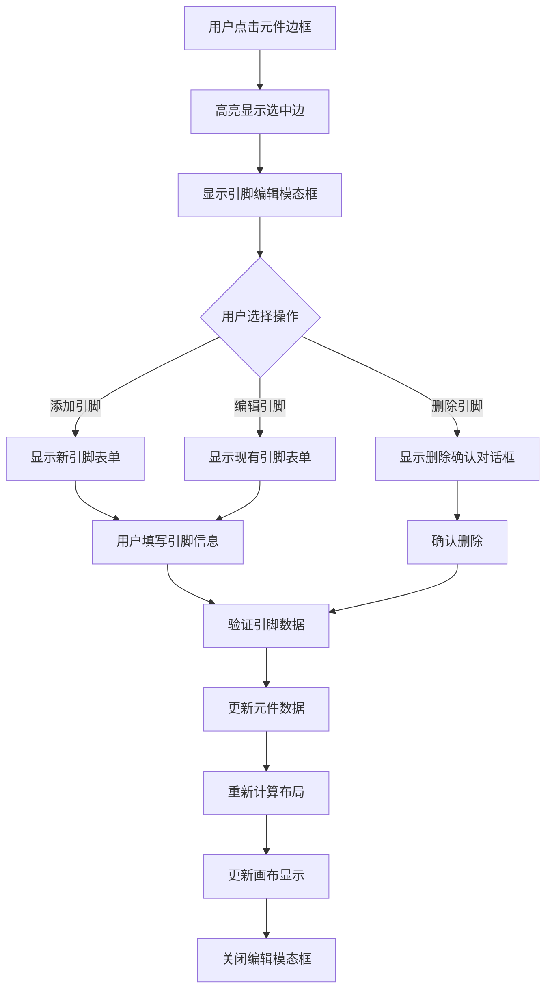

# Fast Hardware - 元件设计器功能详细设计文档

## 📋 文档概述

### 文档目的
本文档详细描述元件管理模块中的元件绘制功能的设计方案，确保功能实现与PRD保持一致，并提供完整的开发指南。

### 功能定位
元件设计器是Fast Hardware的核心功能之一，允许用户创建自定义的电子元件，支持可视化绘制和引脚配置，最终生成符合系统标准的JSON格式元件数据。

---

## 🎯 功能需求分析

### 核心功能
1. **基础元件显示**: 画布中显示一个初始矩形元件主体
2. **边框交互**: 点击元件四条边触发引脚编辑
3. **引脚管理**: 通过弹窗界面添加、编辑、删除引脚
4. **自动布局**: 基于引脚数量自动计算引脚位置（无需可视化显示）
5. **数据导出**: 生成符合PRD标准的JSON格式数据

### 用户场景
- **场景1**: 新手用户创建简单的LED元件
- **场景2**: 高级用户设计复杂的自定义传感器模块
- **场景3**: 开发者复用已有设计进行微调

### 设计约束
- **元件主体**: 固定尺寸的矩形（100x80像素）
- **边框交互**: 四条边均可点击，触发引脚编辑
- **引脚数据**: 引脚名称、类型、序号（用于排序）
- **自动布局**: 基于引脚数量计算位置（后台逻辑，无需显示）

---

## 🎨 用户界面设计

### 整体布局
```
┌─────────────────────────────────────────────────────────────┐
│ 自定义元件设计器                                              │
├─────────────────────────────────────────────────────────────┤
│  ┌─────────────┐  ┌─────────────────────────────────────┐  │
│  │ 属性面板      │  │          设计画布                   │  │
│  │             │  │                                     │  │
│  │ ├─────────┤  │  ├─────────────────────────────────┤  │
│  │ │元件名称 │  │  │  ┌─────────────────────────┐     │  │
│  │ │         │  │  │  │                         │     │  │
│  │ │         │  │  │  │      元件主体矩形         │     │  │
│  │ ├─────────┤  │  │  │   (可调整大小)           │     │  │
│  │ │类别选择 │  │  │  │                         │     │  │
│  │ │         │  │  │  │ ┌─┬─┬─┐ ┌─┐ ┌─┐ ┌─┐ ┌─┐  │     │  │
│  │ ├─────────┤  │  │  │ └─┴─┴─┘ └─┘ └─┘ └─┘ └─┘  │     │  │
│  │ │描述输入 │  │  │  │   side1  side2 side3 side4 │     │  │
│  │ │         │  │  │  │  (上)    (右)  (下)  (左)  │     │  │
│  │ └─────────┘  │  │  └─────────────────────────┘     │  │
│  │               │  │                                     │  │
│  │ ├─────────┤  │  │  ┌─────────────┐ ┌─────────────┐  │  │
│  │ │重置按钮 │  │  │  │ 工具栏        │ │ 状态栏        │  │
│  │ │         │  │  │  │             │ │             │  │
│  │ └─────────┘  │  │  └─────────────┘ └─────────────┘  │  │
│  └─────────────┘  └─────────────────────────────────────┘  │
└─────────────────────────────────────────────────────────────┘
```

### 界面组件详述

#### 1. 属性面板 (左侧，30%宽度)
**位置**: 左侧固定面板
**宽度**: 300px
**包含组件**:
- 元件名称输入框
- 类别选择下拉框
- 描述文本输入框
- 操作按钮区域

#### 2. 设计画布 (右侧，70%宽度)
**画布类型**: 简单的HTML5 Canvas
**画布尺寸**: 600x400px (固定尺寸)
**显示内容**: 居中的矩形元件主体
**交互方式**: 点击四条边触发引脚编辑

#### 3. 工具栏 (画布顶部)
**位置**: 画布上方
**工具按钮**:
- 重置元件 (清除所有引脚)
- 撤销/重做 (操作历史)

#### 4. 状态栏 (画布底部)
**显示信息**:
- 当前操作提示
- 元件基本信息（名称、引脚总数）

---

## 📊 数据结构设计

### 元件数据结构
```json
{
  "name": "自定义传感器",
  "id": "custom-sensor-001",
  "description": "用户自定义的温度湿度传感器",
  "category": "sensor",
  "dimensions": {
    "width": 100,
    "height": 80
  },
  "pins": {
    "side1": [
      {
        "pinName": "VCC",
        "type": "power",
        "order": 1
      },
      {
        "pinName": "GND",
        "type": "ground",
        "order": 2
      }
    ],
    "side2": [
      {
        "pinName": "DATA",
        "type": "digital_io",
        "order": 1
      }
    ],
    "side3": [],
    "side4": []
  },
  "specifications": {},
  "designMetadata": {
    "createdAt": "2024-01-01T00:00:00Z",
    "lastModified": "2024-01-01T00:00:00Z",
    "canvasState": {
      "zoom": 1.0,
      "panX": 0,
      "panY": 0
    }
  }
}
```

### 设计状态数据结构
```javascript
class ComponentDesignerState {
  constructor() {
    this.component = {
      name: '',
      id: '',
      description: '',
      category: 'other',
      dimensions: { width: 100, height: 80 },
      pins: {
        side1: [], // 上边
        side2: [], // 右边
        side3: [], // 下边
        side4: []  // 左边
      }
    };

    this.canvas = {
      zoom: 1.0,
      panX: 0,
      panY: 0,
      gridSize: 10,
      showGrid: true
    };

    this.interaction = {
      selectedSide: null,
      selectedPin: null,
      tool: 'select', // select, pin-edit, zoom
      isDragging: false,
      dragStart: null
    };
  }
}
```

---

## 🔧 核心功能模块

### 1. 画布渲染模块

#### 功能职责
- 绘制居中的元件主体矩形
- 处理鼠标点击事件（检测点击的边）
- 提供简单的视觉反馈（边框高亮）

#### 关键方法
```javascript
class SimpleCanvasRenderer {
  constructor(canvas) {
    this.canvas = canvas;
    this.ctx = canvas.getContext('2d');
    this.componentRect = {
      x: canvas.width / 2 - 50,
      y: canvas.height / 2 - 40,
      width: 100,
      height: 80
    };
  }

  render() {
    this.clearCanvas();
    this.drawComponentBody();
  }

  drawComponentBody() {
    // 绘制元件主体矩形
    this.ctx.fillStyle = '#f0f0f0';
    this.ctx.strokeStyle = '#333';
    this.ctx.lineWidth = 2;
    this.ctx.fillRect(
      this.componentRect.x,
      this.componentRect.y,
      this.componentRect.width,
      this.componentRect.height
    );
    this.ctx.strokeRect(
      this.componentRect.x,
      this.componentRect.y,
      this.componentRect.width,
      this.componentRect.height
    );
  }

  getClickedSide(mouseX, mouseY) {
    const rect = this.componentRect;
    const threshold = 10; // 点击阈值

    // 检查上边
    if (Math.abs(mouseY - rect.y) < threshold &&
        mouseX >= rect.x && mouseX <= rect.x + rect.width) {
      return 'side1';
    }

    // 检查右边
    if (Math.abs(mouseX - (rect.x + rect.width)) < threshold &&
        mouseY >= rect.y && mouseY <= rect.y + rect.height) {
      return 'side2';
    }

    // 检查下边
    if (Math.abs(mouseY - (rect.y + rect.height)) < threshold &&
        mouseX >= rect.x && mouseX <= rect.x + rect.width) {
      return 'side3';
    }

    // 检查左边
    if (Math.abs(mouseX - rect.x) < threshold &&
        mouseY >= rect.y && mouseY <= rect.y + rect.height) {
      return 'side4';
    }

    return null;
  }
}
```

### 2. 引脚管理模块

#### 功能职责
- 添加/删除引脚
- 编辑引脚属性
- 自动排列引脚
- 验证引脚配置

#### 引脚编辑对话框
```html
<div class="pin-editor-modal">
  <div class="modal-header">
    <h3>编辑引脚 - Side1 (上边)</h3>
    <button class="close-btn">&times;</button>
  </div>
  <div class="modal-body">
    <div class="pin-list">
      <div class="pin-item">
        <input type="text" placeholder="引脚名称" value="VCC">
        <select class="pin-type">
          <option value="power">电源</option>
          <option value="ground">地</option>
          <option value="digital_io">数字I/O</option>
          <option value="analog_io">模拟I/O</option>
        </select>
        <button class="delete-pin">删除</button>
      </div>
    </div>
    <button class="add-pin">添加引脚</button>
  </div>
  <div class="modal-footer">
    <button class="btn-secondary">取消</button>
    <button class="btn-primary">保存</button>
  </div>
</div>
```

### 3. 引脚位置计算模块

#### 功能职责
- 基于引脚数量计算引脚在元件中的相对位置
- 为每个引脚分配合适的序号（用于排序）
- 确保引脚位置合理分布

#### 关键方法
```javascript
class PinPositionCalculator {
  calculatePinPositions(pinsData) {
    const positions = {
      side1: [], // 上边
      side2: [], // 右边
      side3: [], // 下边
      side4: []  // 左边
    };

    // 为每个边的引脚分配位置和序号
    Object.keys(pinsData).forEach(side => {
      const sidePins = pinsData[side];
      positions[side] = this.calculateSidePositions(sidePins, side);
    });

    return positions;
  }

  calculateSidePositions(pins, side) {
    if (pins.length === 0) return [];

    // 简单的均匀分布算法
    const positions = [];
    const spacing = 100 / (pins.length + 1); // 百分比位置

    pins.forEach((pin, index) => {
      const position = (index + 1) * spacing; // 10%, 30%, 50%, 70%, 90%
      positions.push({
        pinName: pin.pinName,
        type: pin.type,
        order: index + 1,
        position: Math.round(position) // 四舍五入到整数百分比
      });
    });

    return positions;
  }

  // 更新引脚序号（当添加或删除引脚时）
  updatePinOrders(pinsData) {
    Object.keys(pinsData).forEach(side => {
      pinsData[side].forEach((pin, index) => {
        pin.order = index + 1;
      });
    });
    return pinsData;
  }
}
```

### 4. 交互处理模块

#### 鼠标事件处理
```javascript
class SimpleInteractionManager {
  constructor(canvas, designer) {
    this.canvas = canvas;
    this.designer = designer;
    this.bindEvents();
  }

  bindEvents() {
    this.canvas.addEventListener('click', this.handleCanvasClick.bind(this));
  }

  handleCanvasClick(e) {
    const rect = this.canvas.getBoundingClientRect();
    const mouseX = e.clientX - rect.left;
    const mouseY = e.clientY - rect.top;

    // 检查是否点击了元件边框
    const side = this.designer.renderer.getClickedSide(mouseX, mouseY);
    if (side) {
      this.showPinEditor(side);
    }
  }

  showPinEditor(side) {
    // 显示引脚编辑弹窗
    const modal = new PinEditorModal(side, this.designer);
    modal.show();
  }
}
```

---

## 🔄 交互流程

### 1. 创建新元件流程


### 2. 编辑现有元件流程


### 3. 引脚编辑流程


---

## 💾 数据持久化

### 保存策略
1. **实时同步**: 元件名称与画布内文本实时同步
2. **自动保存**: 设计过程中自动保存草稿到localStorage
3. **手动保存**: 点击保存按钮时验证并保存到元件库
4. **版本管理**: 支持保存多个版本的设计

### 数据验证
```javascript
class DataValidator {
  static validateComponent(component) {
    const errors = [];

    // 验证基本信息
    if (!component.name || component.name.trim() === '') {
      errors.push('元件名称不能为空');
    }

    if (!component.description || component.description.trim() === '') {
      errors.push('元件描述不能为空');
    }

    // 验证引脚数据
    Object.keys(component.pins).forEach(side => {
      component.pins[side].forEach((pin, index) => {
        if (!pin.pinName || pin.pinName.trim() === '') {
          errors.push(`${side}的第${index + 1}个引脚名称不能为空`);
        }

        if (!pin.type || !this.isValidPinType(pin.type)) {
          errors.push(`${side}的第${index + 1}个引脚类型无效`);
        }

        // 检查引脚名称唯一性
        const duplicate = component.pins[side].find((p, i) =>
          i !== index && p.pinName === pin.pinName
        );
        if (duplicate) {
          errors.push(`${side}存在重复的引脚名称: ${pin.pinName}`);
        }
      });
    });

    // 验证尺寸合理性
    if (component.dimensions.width < 50 || component.dimensions.height < 40) {
      errors.push('元件尺寸过小，至少需要50x40单位');
    }

    return errors;
  }

  // 引脚类型验证
  static isValidPinType(type) {
    // ⚠️ 重要概念区分:
    // - 模块类型 (category): 元件的整体功能分类
    // - 引脚类型 (type): 单个引脚的功能分类
    // 例如: HC-05模块的category是"communication"，但其引脚type都是"power"、"ground"、"digital_io"等

    const validTypes = ['power', 'ground', 'digital_io', 'analog_io', 'special'];
    return validTypes.includes(type);
  }
}
```

---

## 🎯 技术实现细节

### 1. 画布技术选择
- **单一技术**: 纯HTML5 Canvas实现
- **简单渲染**: 只绘制居中的矩形元件主体
- **轻量交互**: 基本的鼠标点击检测

### 2. 坐标系统
- **画布坐标**: 基于Canvas的标准坐标系
- **边框检测**: 简单的几何计算检测点击区域
- **固定布局**: 不支持缩放和平移变换

### 3. 性能优化
- **静态渲染**: 固定内容的简单绘制
- **事件节流**: 基本的点击事件处理
- **内存优化**: 最小的对象创建和DOM操作

### 4. 响应式设计
- **固定尺寸**: 600x400px的固定画布尺寸
- **基础交互**: 支持鼠标点击和键盘操作
- **简单适配**: 基本的窗口大小适配

---

## ⚠️ 错误处理

### 常见错误场景
1. **引脚名称冲突**: 同一元件内引脚名称重复
2. **无效引脚类型**: 选择了不支持的引脚类型
3. **布局冲突**: 引脚过多导致布局无法满足约束条件
4. **数据格式错误**: 保存时发现数据结构不符合规范

### 错误处理策略
```javascript
class ErrorHandler {
  static handleError(error, context) {
    console.error('元件设计器错误:', error);

    // 根据错误类型显示不同提示
    switch (error.type) {
      case 'VALIDATION_ERROR':
        this.showValidationError(error.details);
        break;
      case 'LAYOUT_ERROR':
        this.showLayoutError(error.details);
        break;
      case 'SAVE_ERROR':
        this.showSaveError(error.details);
        break;
      default:
        this.showGenericError(error.message);
    }
  }

  static showValidationError(details) {
    const modal = document.createElement('div');
    modal.className = 'error-modal';
    modal.innerHTML = `
      <div class="error-content">
        <h3>数据验证失败</h3>
        <ul>
          ${details.map(detail => `<li>${detail}</li>`).join('')}
        </ul>
        <button class="btn-primary" onclick="this.closest('.error-modal').remove()">确定</button>
      </div>
    `;
    document.body.appendChild(modal);
  }
}
```

---

## 🧪 测试用例

### 单元测试
1. **引脚管理测试**
   - 添加/删除引脚功能正常
   - 引脚数据验证正确
   - 引脚布局计算准确

2. **自动布局测试**
   - 不同引脚数量的布局正确
   - 尺寸自动调整符合预期
   - 边界约束满足要求

3. **数据持久化测试**
   - JSON格式生成正确
   - 数据保存和加载正常
   - 版本管理功能正常

### 集成测试
1. **完整设计流程测试**
   - 从创建到保存的完整流程
   - 错误场景的处理
   - 性能表现测试

2. **兼容性测试**
   - 不同浏览器支持情况
   - 移动设备适配测试
   - 不同分辨率下的显示效果

### 用户验收测试
1. **新手用户测试**
   - 界面易用性评估
   - 功能理解度测试
   - 错误恢复能力测试

2. **高级用户测试**
   - 复杂元件设计能力
   - 性能和稳定性评估
   - 扩展功能需求收集

---

## 📋 开发计划

### 阶段一：核心功能实现 ✅ 已完成
- [x] 设计器界面框架搭建
- [x] 简单画布渲染（居中矩形）
- [x] 元件属性面板实现
- [x] 边框点击检测
- [x] 选中边框视觉反馈（红色高亮）

### 阶段二：引脚管理功能 ✅ 已完成
- [x] 引脚数据管理和验证
- [x] 引脚位置计算逻辑
- [x] 数据保存和加载

### 阶段三：优化和完善 ✅ 已完成
- [x] 画布增强功能（缩放、拖动、圆角、居中文字）
- [x] 尺寸控制和双向同步
- [x] 引脚布局优化和居中对齐
- [x] 元件数据结构清理和格式统一
- [x] 用户体验优化
- [x] 错误处理和状态同步

### 阶段四：集成测试 
- [ ] 与元件库系统集成
- [ ] JSON格式验证
- [ ] 边界情况测试
- [ ] 文档完善

---

## 📚 相关文档

### 依赖文档
- [PRD.md](./PRD.md) - 产品需求文档
- [README.md](./README.md) - 项目说明文档
- [data/README.md](./data/README.md) - 数据结构说明

---

## 🔄 开发进度记录

### 阶段一完成总结 ✅
**完成时间**: 2024年12月
**主要成果**:
- ✅ 完整的设计器界面框架（左右分栏布局）
- ✅ 居中矩形元件显示和画布渲染
- ✅ 元件属性面板（名称、类别、描述输入）
- ✅ 四条边框的点击检测功能
- ✅ 选中边框的红色高亮视觉反馈
- ✅ 悬浮按钮布局优化
- ✅ 画布初始化bug修复

**技术亮点**:
- 事件驱动的初始化机制
- 模块化的渲染器和交互器设计
- 响应式的悬浮按钮布局
- 完整的错误处理和状态管理

**用户体验**:
- 直观的元件设计界面
- 实时的视觉反馈
- 流畅的交互体验
- 清晰的状态提示

**下一阶段**: 阶段二 - 引脚管理功能实现

---

## 🔄 开发进度记录

### 阶段二完成总结 ✅
**完成时间**: 2024年12月
**主要成果**:
- ✅ 完整的引脚编辑模态框系统
- ✅ 引脚的添加、编辑、删除功能
- ✅ 引脚数据验证和错误处理
- ✅ 引脚位置自动计算逻辑
- ✅ 引脚可视化显示（彩色圆点+标签）
- ✅ 元件数据保存到JSON文件
- ✅ 全局引脚名称唯一性验证

**技术亮点**:
- 事件驱动的模态框管理
- 自动化的引脚位置计算
- 类型化的引脚颜色编码
- 完整的CRUD操作支持
- 实时数据验证和反馈
- 文件系统集成的数据持久化

**用户体验**:
- 直观的引脚编辑界面
- 实时视觉反馈和验证
- 流畅的交互体验
- 彩色编码的引脚类型识别
- 智能的错误提示和处理

**下一阶段**: 阶段三 - 优化和完善

---

## 🔄 开发进度记录

### 阶段三完成总结 ✅
**完成时间**: 2024年12月
**主要成果**:
- ✅ 画布增强功能（缩放、拖动、圆角、居中文字显示）
- ✅ 尺寸控制功能（手动调整元件尺寸）
- ✅ 双向同步机制（属性栏与画布尺寸同步）
- ✅ 引脚布局优化（精确居中对齐算法）
- ✅ 元件数据结构清理（移除技术规格，统一格式）
- ✅ 用户体验优化（错误处理、状态同步、视觉一致性）

**技术亮点**:
- 智能的尺寸自适应算法
- 精确的引脚居中对齐计算
- 双向数据同步机制
- 统一的元件数据格式
- 完善的错误处理和边界检查

**用户体验**:
- 直观的尺寸控制界面
- 实时的视觉反馈
- 精确的引脚对齐
- 一致的数据格式
- 流畅的交互体验

**下一阶段**: 阶段四 - 集成测试

---

## 📊 项目状态概览

| 阶段 | 状态 | 进度 | 负责人 |
|------|------|------|--------|
| 阶段一：核心功能 | ✅ 已完成 | 100% | 开发团队 |
| 阶段二：引脚管理 | ✅ 已完成 | 100% | 开发团队 |
| 阶段三：优化完善 | ✅ 已完成 | 100% | 开发团队 |
| 阶段四：集成测试 | ⏳ 待规划 | 0% | 开发团队 |

**总体进度**: 75% (3/4阶段完成)